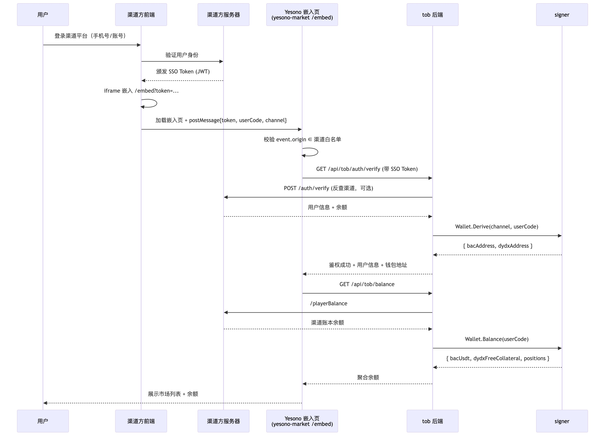
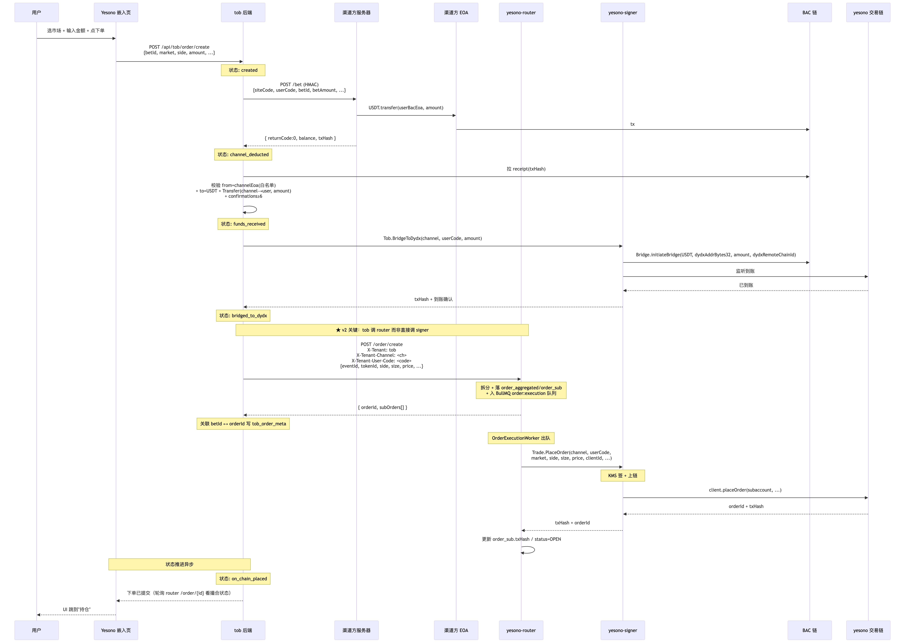
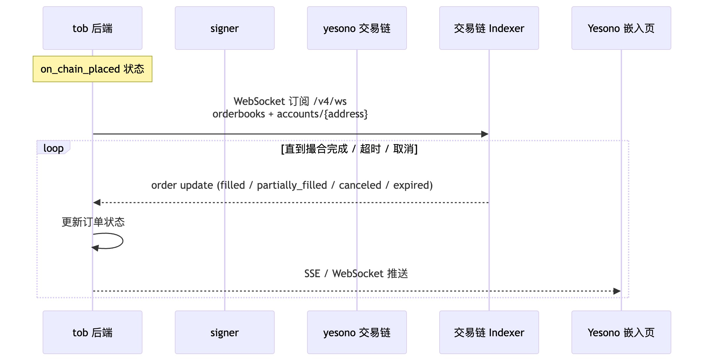
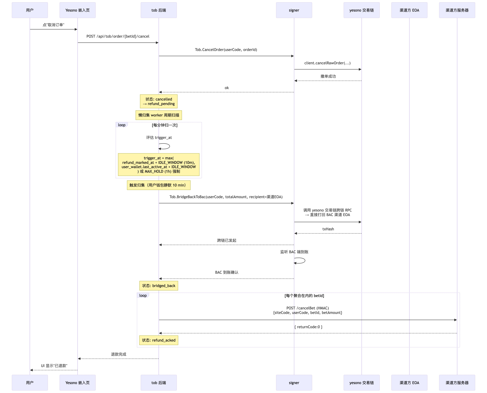
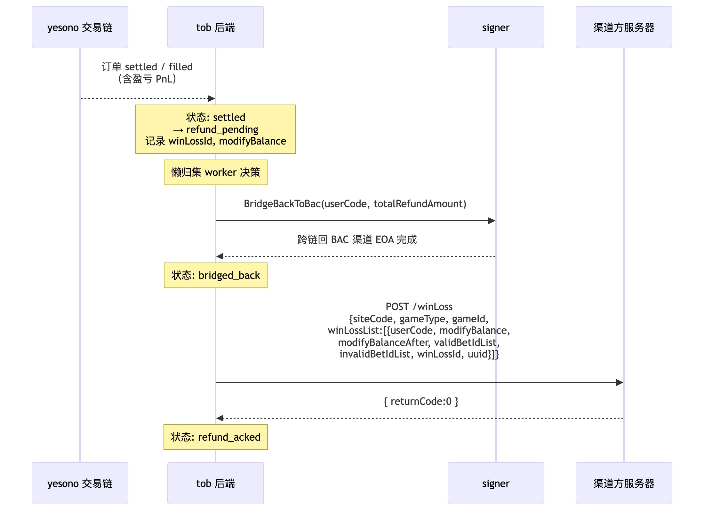
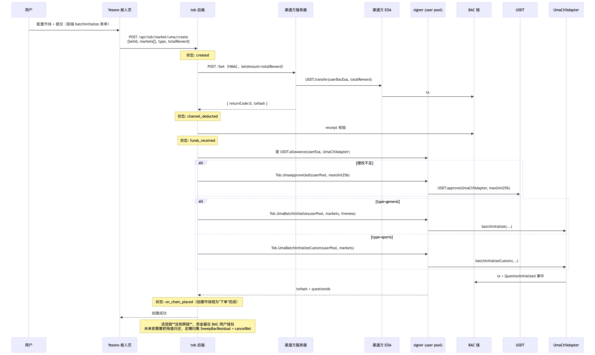
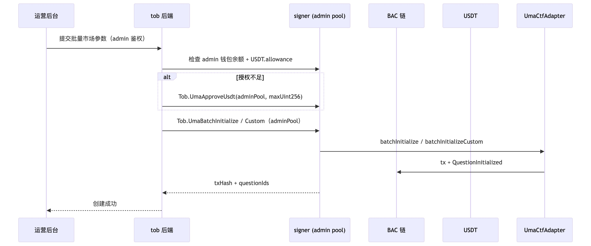
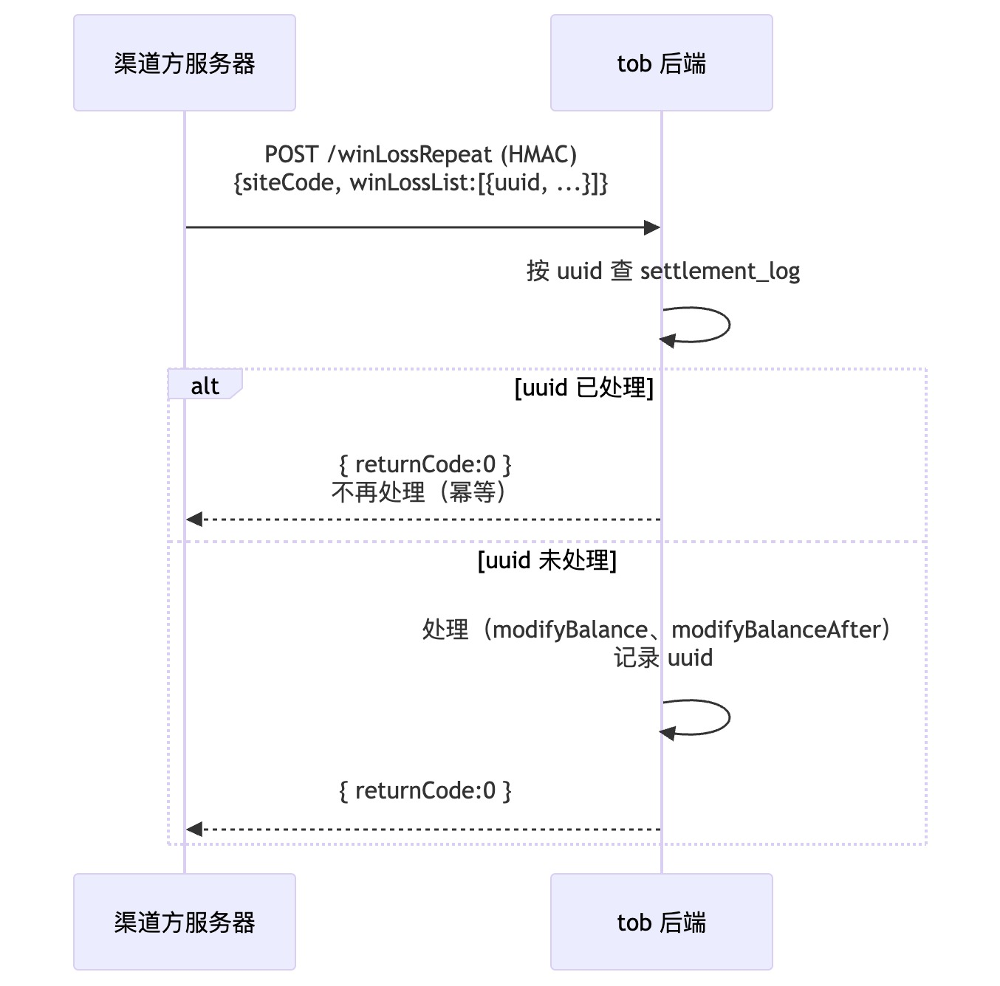
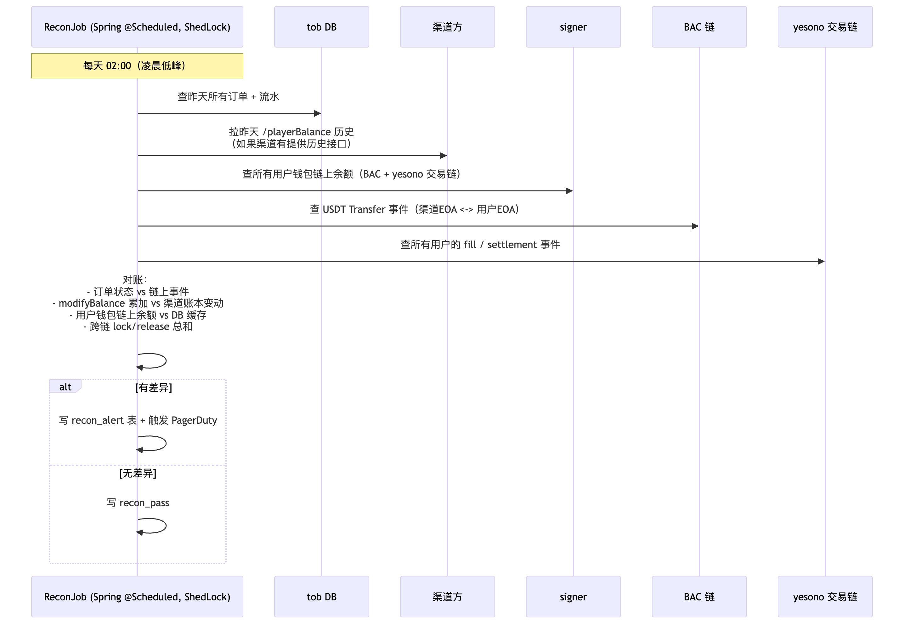

Yesono × 渠道方对接 — 总体架构与全流程 PRD

> 文档版本：v2.2
> 创建日期：2026-04-27（v1.0）/ 2026-04-28（v2.0 / v2.1）/ 2026-04-29（v2.2）
> 状态：草稿（待与渠道方对齐后转 v2.3）
> 受众：全员（产品 / 后端 / 前端 / 合约 / 运维 / 安全）

---

1. 业务背景

Yesono 业务由两条自部署链构成：
- BAC 链：自建 EVM 链，承载用户托管 EOA、USDT、跨链桥、AllbetMarketV1（亚盘足球）、UmaCtfAdapter（市场创建）等。测试网 chainId = 66666，主网 chainId = 723
- yesono 交易链：撮合 / 持仓 / 结算引擎，基于 dYdX v4 fork 自部署（含 validator + indexer + 跨链桥），SDK 引用 `@h2protocol/v4-client-js`，chainId `ba-mainnet`

BAC ↔ yesono 交易链的跨链桥已由内部交易链团队完成。

现需对接 B 端渠道方：

- 渠道方有自己的法币/积分账本与登录体系
- 渠道方将 Yesono 前端通过 iframe 嵌入到自己的页面里供用户使用
- 渠道方在 BAC 链上自管 EOA 钱包（私钥归渠道方），作为资金池对外转账
- 用户在渠道方下注 → 渠道方扣本地账本余额 → 渠道方 EOA 上链给用户钱包转 USDT → Yesono 跨链到 yesono 交易链 → 在 yesono 交易链撮合引擎下单
- 用户取消/结算后 → yesono 交易链跨链桥直接打回渠道方 EOA → Yesono 调渠道方 /cancelBet 或 /winLoss → 渠道方账本回滚或结算
已确认的核心选型：

- 资金方案：EOA 方案（不再使用多签合约方案）
- 用户钱包：Yesono 托管 EOA，每渠道+用户派生独立地址，私钥由 signer 在 KMS 内保管
- 钱包池：tob 租户分四池（user / operator / admin / gas-tank）
- 退款策略：懒归集（默认静默 10 min，兜底 1h）
- 跨链桥：BAC 端桥合约已开发完成（不在本计划范围）；yesono 交易链端跨链 RPC 由内部交易链团队负责
- 链上凭证：以 BAC 链 receipt 为准（精确校验 from / to / token / amount / confirmations）。EOA 方案下 receipt 本身就是密码学不可伪造的非否认证据（渠道用自己私钥发的链上 tx），不要求渠道方再额外返回 EIP-712 签名。`/bet` 接口的 HTTPS + HMAC + receipt 校验三层已足够

复用主站资产：

- 前端：[yesono-market/](../../yesono-market/) — Next.js 14，yesono 交易链 SDK 集成（基于 dYdX v4 fork）+ 跨链桥 + AllbetMarketV1 + UmaCtfAdapter + Privy/AA 智能账户全部已实现
- 后端：[prediction-market-service/](../../prediction-market-service/) — Spring Boot 多模块，含 bachain-sdk-java、订单聚合、JWT、PostgreSQL、@Scheduled

---

2. 总体架构

2.1 组件视图（v2 集中执行架构）

渠道方域：
  渠道方前端 ─iframe─ Yesono 嵌入页    渠道方服务器（持渠道 EOA 私钥 + 9 个钱包接口）
       │                                       ↑
       │ SSO Token                             │ HTTPS + HMAC（tob 调）
       │                                       │
═══════│═══════════════════════════════════════│═══════════════════════════════
       │                                       │
Yesono 域：                                    │
       ▼                                       │
  ┌─────────────────────┐                      │
  │ yesono-market（前端）    │                      │
  │  C 端：主站模式       │                      │
  │  B 端：/embed/* 嵌入 │                      │
  └────┬────────────────┘                      │
       │                                       │
   ┌───┴────┐                                  │
   │        │                                  │
   ▼        ▼                                  │
 (主站)    POST /api/tob/...        ┌──────────┘
   │         │                      │
   │         ▼                      ▼
   │     ┌──────────────────────────────────┐
   │     │ prediction-market-service-tob     │
   │     │ （新增 Java module，无私钥）       │
   │     │  • 渠道方 9 接口对接               │
   │     │  • 订单状态机（渠道侧 + 跨链中间态）│
   │     │  • 链上 receipt 校验               │
   │     │  • 懒归集 / 对账                   │
   │     └────┬──────────────────────┬─────┘
   │          │ HTTPS（创建订单）       │ mTLS（split/merge/redeem
   │          │                       │  + 创建市场 + 跨链 + sweep）
   │          ▼                       │
   ▼     ┌──────────────────────┐     │
   └────→│ yesono-router        │     │
         │ （重构：纯订单协调）   │     │
         │  • /order/create      │     │
         │  • 订单拆分 + 入队     │     │
         │  • 状态同步任务（30s）│     │
         │  • 不持私钥（重构后）  │     │
         └──────────┬───────────┘     │
                    │ mTLS（链上执行） │
                    ▼                  ▼
                 ┌────────────────────────────────────────┐
                 │ yesono-signer（新建独立 TS）            │
                 │  ★ 集团唯一执行层                       │
                 │  ★ 多租户：c-end / tob / 其他 / 其他2 │
                 │  • KMS / HSM 私钥管理                  │
                 │  • yesono 交易链 SDK / Polymarket CLOB │
                 │  • 跨链桥（BAC↔yesono 交易链、POL→BAC）│
                 │  • CTF Split / Merge / Redeem         │
                 │  • AllbetMarketV1 / UmaCtfAdapter      │
                 │  • EIP-712 签名（CheckMarket 等）      │
                 │  • Gas-tank（多链）                    │
                 │  • Nonce / 限额 / 审计                 │
                 └─────────────┬────────────────┬───────┘
                               │                │
                               ▼                ▼
                          BAC 链           yesono 交易链 / Polygon
                                            等其他链

主站 Postgres（所有项目共用）：users / markets / order_aggregated / order_sub /
  bk_user_balances / bk_user_chain_transactions / bk_user_create_market_record / tob_*

扫链服务（独立项目）：写 bk_user_*（按 EOA 地址索引到 user_id）

2.1.1 关键调用路径

C 端下单（router 重构 Phase 2 完成后）：
yesono-market → router /order/create → 拆分 + 入队 → OrderExecutionWorker
                                                  → signer.Trade.PlaceOrder
                                                  → KMS 签 + 上链
                                                  → 回写 router 订单 status/txHash

B 端下单（router 重构 Phase 1 起即可）：
嵌入页 → tob /api/tob/order/create
        → tob 调渠道方 /bet
        → tob receipt 校验
        → tob 调 router /order/create（带 X-Tenant: tob 等 header）
        → router 拆分 + 入队 → OrderExecutionWorker（识别 tob 租户）
        → signer.Trade.PlaceOrder
        → KMS 签 + 上链

B 端 Split / Merge / Redeem（v2.1：router 按租户分流，B 端走后端执行）：
tob → router /order/split → router ActionService 落 ActionSubOrder
                              ↓ tenant=tob → status=PENDING（后端执行）
                              ↓ executeBackendActions 出队
                              ↓ router 调 signer.Trade.CtfSplit/Merge/Redeem
                              ↓ signer KMS 签 + 上链
                              ↓ router 回写 ActionSubOrder.txHash / status=COMPLETED
                              ↓ tob 通过 router /order/{id} 查状态
注：C 端 INTERNAL 仍走 CLIENT_EXECUTE 让前端执行，零改动。

B 端 跨链 / 创建市场 / sweep / EIP-712 签名（不经 router，tob 直接调 signer）：
tob → signer.Bridge.* / signer.Tob.AllbetCreateMarket / signer.Tob.UmaBatchInitialize
     / signer.Refund.SweepBacResidual / signer.Tob.AllbetSignCheckMarket
当前 router 不管理这些（Allbet / Uma 不在 router 订单体系；跨链 / sweep 不属于"订单"概念；纯签名不上链）。

2.2 资金流（USDT）

渠道方 EOA ──直接转账──> BAC 用户 EOA ──跨链──> yesono 交易链账户 ──下单/结算──> 持仓
                                                                │
                                                                ▼
                                yesono 交易链跨链 RPC ──跨链──> BAC 渠道方 EOA
                                                                │
                                                                ▼
                                                       调 B 端 cancelBet / winLoss
                                                       渠道方账本结算

2.3 信息流（订单）

前端嵌入页 ─下单请求→ tob ─/bet→ 渠道方 ─返回 txHash→ tob ─链上 receipt 校验→ tob
  │                                                                              │
  │                                                                              ▼
  │                                                                      tob ─跨链→ signer
  │                                                                              │
  │                                                                              ▼
  │                                                              signer ─下单→ yesono 交易链
  │                                                                              │
  ◀─────────────── 订单状态推送（轮询 / WebSocket） ◀──────────────── tob 索引/对账

2.4 项目部署形态

组件
部署形态
暴露面
持私钥
yesono-market（嵌入模式）
Cloudflare Pages，新增 /embed/* 路由
公网（被 iframe 嵌入）
❌
prediction-market-service-tob
主站 Spring Boot 集群新增 module
公网（前端 + 渠道回调）
❌
BAC 链合约
已部署
链上
—

---

3. 全流程时序图

3.1 流程总览

流程
章节
用户登录 + iframe 嵌入 + 鉴权
§3.2
用户下单（核心）
§3.3
yesono 交易链下单后撮合 + 持仓
§3.4
用户取消订单（懒归集）
§3.5
订单结算（winLoss）
§3.6
异常分支：跨链失败 / 链上验证失败
§3.7
亚盘足球：用户下注 / 领取（AllbetMarketV1）
§3.8
平台方：批量创建市场（UmaCtfAdapter）
§3.9
平台方：CheckMarket EIP-712 签名（AllbetMarketV1）
§3.10
渠道方主动重发：winLossRepeat / winLossModifyRepeat
§3.11
每日对账
§3.12

---

3.2 用户登录 + iframe 嵌入 + 鉴权

关键点：

- SSO Token 由渠道方签发，tob 解 JWT 后可选反查 `/auth/verify`（建议第一版反查保险）
- 嵌入页严格校验 event.origin 防 iframe 劫持
- 钱包地址在用户首次登录时懒派生（首访时 Wallet.Derive 才创建）
- 余额聚合：渠道账本 + BAC USDT + yesono 交易链 freeCollateral 三者一并返回

---

3.3 用户下单（核心流程，v2 经 router 中转）

关键校验点：

1. /bet 调用幂等：`betId` 全局唯一，重复调用 `/bet` tob 直接返回上次结果
2. Receipt 校验是 EOA 方案的安全核心：渠道方任何返回的 txHash 都必须经链上验证全字段匹配，否则状态停留 channel_deducted 不进 funds_received
3. 跨链到账确认：BAC `initiateBridge` 上链 ≠ yesono 交易链到账，必须有交易链端到账确认信号才推 bridged_to_dydx（状态名保留 `bridged_to_dydx` 是兼容旧字段）
4. router 是订单核心表的写入方：tob 不直接 INSERT `order_aggregated/order_sub`，调 router `/order/create` 由 router 落表，tob 仅在 `tob_order_meta` 落业务侧字段（betId / channel_tx_hash / refund 状态等）
5. router → signer 是同步调用：OrderExecutionWorker 阻塞等待 signer 返回 txHash 才更新 status；signer 不可用时订单卡在 PENDING（不本地降级签名）
6. 下单失败的回滚：见 §3.7 异常分支

---

3.4 yesono 交易链下单后撮合 + 持仓更新

yesono 交易链撮合是异步的：placeOrder 返回 orderId 不代表已撮合。

说明：yesono 交易链订单簿是中心化撮合（结算在链上），用 Indexer WebSocket 订阅订单状态最高效；本期 tob 用轮询 indexer 也可以（每 2-3 秒轮一次），降低实现复杂度。

---

3.5 用户取消订单（懒归集）

懒归集策略：

trigger_at = max(
  order.refund_marked_at + IDLE_WINDOW,       // 此订单标记退款后的静默期
  user_wallet.last_active_at + IDLE_WINDOW    // 整个用户钱包的活跃静默
)
MAX_HOLD = 1h  // 兜底，无论是否活跃必须归集

- 默认 IDLE_WINDOW = 10min、MAX_HOLD = 1h，配置化
- 同一 userCode 的多笔 refund_pending 订单聚合为一笔 BridgeBackToBac，一次跨链 + 多次 cancelBet
- ⚠ 待确认（Q1/Q2）：渠道方是否能接受"调 cancelBet 时间晚于订单状态变化时间"，以及在懒归集窗口内 `playerBalance` 应返回什么

---

3.6 订单结算（winLoss）

yesono 交易链订单成交并结算后：

关键：
- modifyBalance 计算：以 yesono 交易链上实际成交后用户净盈亏为准（freeCollateral 变化）
- invalidBetIdList：当某些下注因为撮合失败/无效成为"无效注单"时，按 [b端对接示例.md:5-11](b端对接示例.md) 处理（标记 invalid，等后续 cancelBet 才退款）
- uuid：余额变动流水，全局唯一，作 winLossRepeat 幂等键

---

3.7 异常分支

3.7.1 链上验证失败（receipt.from 不在白名单 / 金额不匹配 / 确认数不足）

状态: channel_deducted (停留)
→ 重试 N 次拉 receipt 仍不通过 → 进入人工核对队列
→ 通知运维 + 联系渠道方对账

不会自动推到 funds_received，资金安全优先。

3.7.2 跨链卡单（BAC → yesono 交易链）

状态: funds_received → 触发 BridgeToDydx
→ BAC lock 上链成功，但 yesono 交易链端长时间未到账（超时 30min）
→ 状态停留 funds_received
→ 进入"残留兜底"分支:
   1. signer.SweepBacResidual (用户 BAC EOA 仍有 USDT，转回渠道 EOA)
   2. tob 调 /cancelBet
   3. 状态推到 refund_acked

3.7.3 yesono 交易链下单失败

状态: bridged_to_dydx → 调 PlaceOrder 失败
→ 进入"残留兜底"分支:
   1. signer.BridgeBackToBac (交易链余额跨回 BAC 渠道 EOA)
   2. tob 调 /cancelBet
   3. 状态推到 refund_acked

---

3.9 批量创建市场（UmaCtfAdapter）

UmaCtfAdapter.batchInitialize / batchInitializeCustom 支持两类发起方：

发起方
资金来源
调用入口
signer 钱包池
| B 端普通用户 | 用户钱包内的 USDT（reward × markets.length 由用户自付）| `/api/tob/market/uma/create` | `tob:user`（即用户托管 EOA）|
| 平台运营 | 平台 admin 钱包内的 USDT | `/admin/tob/uma/batch-initialize` | `tob:admin` |

两条路径合约层一致，差异在：扣款来源、是否走 B 端 /bet 接口、调用 signer 时使用哪个钱包池。

3.9.1 用户发起（B 端用户在前端创建市场）

3.9.2 平台发起（运营后台批量开盘）

3.9.3 通用关键点

- batchInitialize vs batchInitializeCustom：体育类用 Custom（无 liveness 参数）；其他用 batchInitialize
- ⚠ 已部署市场再次 batchInitialize 会 revert `QuestionAlreadyInitialized`，调用前 tob 必须按 questionId 过滤已初始化的（参考 yesono-market `CLAUDE.md`）
- USDT 授权策略：用户钱包 / admin 钱包均建议第一次 max approve 一次（命中 allowance 缓存后续跳过）
- 事件解析：监听 QuestionInitialized 事件回写 questionId 到 tob 数据库
- ⚠ 用户路径必须走 receipt 校验：和普通下单一致，`/bet` → 校验 from/to/amount → 才能继续；admin 路径直接动 admin 钱包，不走 `/bet`

---

3.11 渠道方主动重发：winLossRepeat / winLossModifyRepeat

按 [b端对接示例.md:161-294](b端对接示例.md) 协议，渠道方对 winLoss / winLossModify 做超时重发：

幂等键：`uuid`（余额变动流水 ID）。

---

3.12 每日对账

---

4. 订单状态机（含异常分支）

┌─────────┐
│ created │
└────┬────┘
     │ /bet 成功 + 渠道返回 txHash
     ▼
┌──────────────────┐
│ channel_deducted │── /bet 失败 ──→ failed
└────┬─────────────┘
     │ 链上 receipt 校验通过（from/to/amount/confirm）
     ▼
┌────────────────┐         校验失败 N 次（金额错/from错/confirm 不足）
│ funds_received │──────────────────────────────────────────────→ manual_review
└────┬───────────┘
     │ 触发 BridgeToDydx
     ▼
┌──────────────────┐         跨链超时（1min）
│ bridged_to_dydx  │─────────────────────────→ refund_pending → bridged_back → refund_acked
└────┬─────────────┘                               (Sweep BAC 残留 + cancelBet)
     │ 调 PlaceOrder
     ▼
┌──────────────────┐         下单失败
│ on_chain_placed  │─────────────────────────→ refund_pending → bridged_back → refund_acked
└────┬─────────────┘                               (BridgeBackToBac + cancelBet)
     │ yesono 交易链撮合 (filled / cancelled / expired / settled)
     ▼
┌────────────┬───────────┬───────────┬────────┐
│  settled   │ cancelled │  expired  │ failed │
└─────┬──────┴─────┬─────┴─────┬─────┴────────┘
      └────────────┼───────────┘
                   ▼
           ┌────────────────┐
           │ refund_pending │  懒归集等待中
           └────────┬───────┘
                    │ trigger_at 到达
                    ▼
           ┌────────────────┐
           │ bridged_back   │  yesono 交易链 → BAC 渠道 EOA
           └────────┬───────┘
                    │ 调 cancelBet (取消) or winLoss (结算)
                    ▼
           ┌────────────────┐
           │ refund_acked   │  终态
           └────────────────┘

状态字段定义

状态
含义
持续时间预期
created
订单已收到，未调 /bet
<1s
channel_deducted
/bet 已成功，等链上验证
数秒
funds_received
链上 receipt 已通过校验
<1s
bridged_to_dydx
跨链已确认到达 yesono 交易链（字段名保留兼容历史）
<30s
on_chain_placed
yesono 交易链下单成功，等撮合
几秒到几小时
settled / cancelled / expired / failed
yesono 交易链端结果
终态（前置）
refund_pending
等懒归集
10min ~ 1h
bridged_back
跨链回 BAC 渠道 EOA 已确认
<30s
refund_acked
B 端结算/取消已确认
终态
manual_review
人工介入（异常）
不限

---

5. 接口契约清单

5.1 接口总览（v2）

方向
调用方
被调方
协议
列表
①
渠道前端
Yesono 嵌入页
postMessage
SSO Token 交换、token 续期
②
Yesono 嵌入页
tob 后端
HTTPS + JWT
/api/tob/auth/* /order/* /balance /wallet /allbet/* /market/*
③
tob 后端
渠道方服务器
HTTPS + HMAC

/playerBalance /bet /cancelBet /winLoss /winLossRepeat /winLossModify /winLossModifyRepeat /tip /auth/verify
④
渠道方服务器
tob 后端
HTTPS + HMAC
（回调）winLossRepeat 等的请求方向
详细接口定义在各项目 PRD 中。本文档列总览。

5.2 ② 嵌入页 ↔ tob 后端 API 总览

Method
Path
说明
POST
/api/tob/auth/verify
SSO Token 校验
GET
/api/tob/auth/refresh
Token 续期
GET
/api/tob/balance
聚合余额（渠道 + BAC + yesono 交易链）
GET
/api/tob/wallet/address
返回用户 BAC EOA + yesono 交易链 bech32 地址
GET
/api/tob/market/list
市场列表（yesono 交易链 + 亚盘 + Uma 聚合）
| POST | **`/api/tob/market/uma/create`** | 用户批量创建 Uma 市场（batchInitialize / Custom） |
| POST | /api/tob/order/create | 下单（yesono 交易链路径）|
| POST | /api/tob/order/{betId}/cancel | 取消订单 |
| GET | /api/tob/order/list | 用户订单列表 |
| GET | /api/tob/order/{betId} | 订单详情 |
| POST | /api/tob/allbet/stake | 亚盘下注 |
| POST | /api/tob/allbet/claim | 亚盘领取 |
| GET | /api/tob/allbet/markets | 亚盘市场列表 |
| POST | **`/api/tob/allbet/market/create`** | 用户创建亚盘市场（含 CheckMarket EIP-712 + createMarket） |

管理后台 API（admin 鉴权，不在公开前端暴露）：

Method
Path
说明
POST
/admin/tob/uma/batch-initialize
平台 admin 批量创建 Uma 市场
POST
/admin/tob/uma/batch-initialize-custom
平台 admin 批量创建体育类（无 liveness）
POST
/admin/tob/allbet/create-market
平台 admin 创建亚盘市场
POST
/admin/tob/allbet/withdraw-bond
平台 admin 提取保证金

5.3 ③ tob ↔ 渠道方 API 总览

按 [b端对接示例.md](b端对接示例.md) 实现 9 个接口：

接口
方向
幂等键
说明
/playerBalance
tob → 渠道
userCode
查询余额
/bet
tob → 渠道
betId
下注扣款
/cancelBet
tob → 渠道
betId
取消退款
/winLoss
tob → 渠道
uuid
结算
/winLossRepeat
渠道 → tob
uuid
结算重发
/winLossModify
tob → 渠道
uuid
结算修改
/winLossModifyRepeat
渠道 → tob
uuid
结算修改重发
/tip
tob → 渠道
tipId
小费

5.4 ⑤ tob ↔ signer gRPC 总览

详见 [PRD-signer-platform.md](PRD-signer-platform.md) 与 [PRD-signer-tob-module.md](PRD-signer-tob-module.md)。

---

6. 安全架构总览

6.1 私钥分布

私钥
所有方
存储位置
渠道方 EOA 私钥
渠道方
渠道方自有（不在 Yesono 体系内）
用户托管 EOA
Yesono
signer KMS
Operator 钱包（CheckMarket 签名）
Yesono
signer KMS
Admin 钱包（市场创建）
Yesono
signer KMS
Gas-tank EOA
Yesono
signer KMS
yesono 交易链账户私钥
Yesono（从同一 BAC EOA 私钥确定性派生）
signer KMS（运行时派生，不持久化）

6.2 信任链与防御纵深

[攻击者]
  │
  ├─ 攻击渠道方前端 → 拿不到 token（HttpOnly）+ origin 校验拦截
  ├─ 攻击 Yesono 嵌入页 → CSP 限制 + 不持私钥
  ├─ 攻击 tob 后端 → 不持私钥；只能影响业务编排，无法直接出资金
  ├─ 攻击 signer 入口 → mTLS + API key + 多租户隔离 + 限额 + 审计告警
  ├─ 攻击 KMS → 需要 KMS provider 自身被攻破（极低概率）+ Yesono 账号控制权
  └─ 链上重放 / 伪造 → betId 唯一 + receipt 全字段校验 + 渠道EOA 白名单

6.3 关键安全防线（按重要性排序）

1. 链上 receipt 校验：渠道方任何返回的 txHash 都要经过 from/to/token/amount/confirmations 五项校验，是 EOA 方案的资金安全核心
2. 渠道 EOA 白名单：每个 channel 配置中绑定唯一 EOA，from 不在白名单直接拒绝
3. 私钥单点持有：除签名服务外的任何组件被攻破，私钥不会泄漏
4. 多租户隔离：KMS partition + DB tenant_id + mTLS + 网关路由四层叠加
5. 限额与告警：每租户独立限额池 + 异常行为基线 + 三级冻结开关
6. B 端接口防重放：timestamp + nonce + HMAC + 5min 窗口
7. 订单幂等：betId 全局唯一 + uuid 流水唯一

---

7. 术语表

术语
含义
渠道方 / B 端
接入 Yesono 的B端客户
siteCode
渠道方在 Yesono 系统中的唯一标识
userCode
用户在渠道方系统中的唯一标识
betId
单笔下注的全局唯一 ID（幂等键）
uuid
余额变动流水 ID（结算幂等键）
渠道方 EOA
渠道方在 BAC 链上自管的资金钱包
用户托管 EOA / 用户钱包
Yesono 为每用户派生的 BAC EOA，私钥由 signer 保管
Operator 钱包
项目方业务签名钱包（如 CheckMarket）
Admin 钱包
项目方运营钱包（如创建市场）
Gas-tank
给所有用户钱包补 BAC 原生币 gas 的 EOA
user-pool / operator-pool / admin-pool
signer 内按用途分类的钱包池
| BAC 链 | Yesono 自部署 EVM 链（测试网 chainId 66666 / 主网 chainId 723）|
| 跨链桥 | BAC ↔ yesono 交易链资产跨链协议（合约 + RPC）|
| 懒归集 | 静默窗口达到后才触发跨链归集，避免反复搬资金 |
| UmaCtfAdapter | BAC 链上其他预测市场创建合约（基于 Uma + CTF）|
| CTF | Conditional Token Framework |
| EOA 方案 | 渠道方自管 EOA、不用多签合约的资金对接方案 |
| 多租户 | signer 同时服务 tob / 其他 / 其他2等多个业务方 |

---

8. 待确认事项汇总

参考主计划 [evm-b-yesono-...md](../../../21437/.claude/plans/evm-b-yesono-b-yesono-yesono-usdt-b-api-lively-rabbit.md) §"待与 B 端渠道方确认的问题清单" 与 §"关键决策待跟进"。要点：

ID
主题
影响
Q1
是否每单都调 cancelBet/winLoss？是否支持批量？
影响 LazyCollector 的归集粒度
Q2
懒归集窗口能否被渠道方接受？
影响 Q1 
Q3
嵌入页余额展示来源
前端 + tob /balance 接口设计
Q4
渠道 EOA 控制及转账实现
合作协议条款

---

9. 后续步骤

1. 各项目 PRD 评审（本文档 + 4 份子 PRD）
2. 与渠道方对接 Q1-Q8
3. 与内部交易链团队对接 D3 + 跨链桥契约
4. 内部确认 D1-D5
5. 各项目按 PRD 与排期开发，按 §3 流程联调